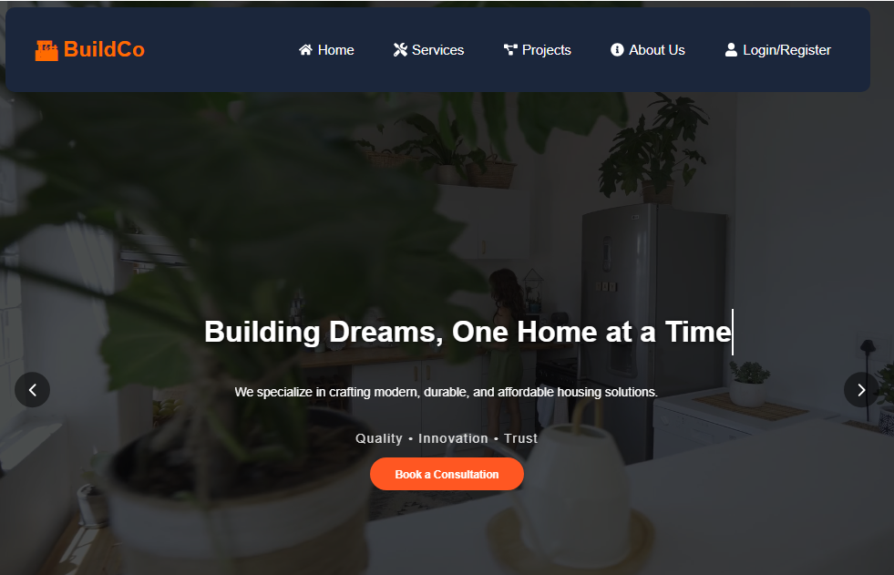
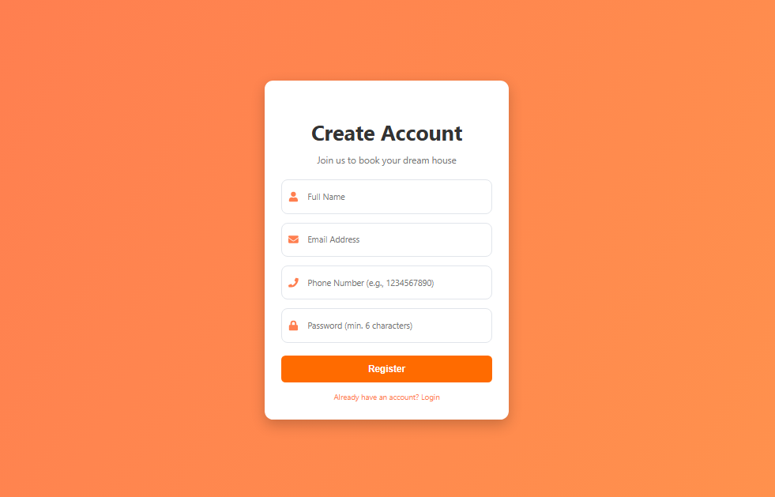
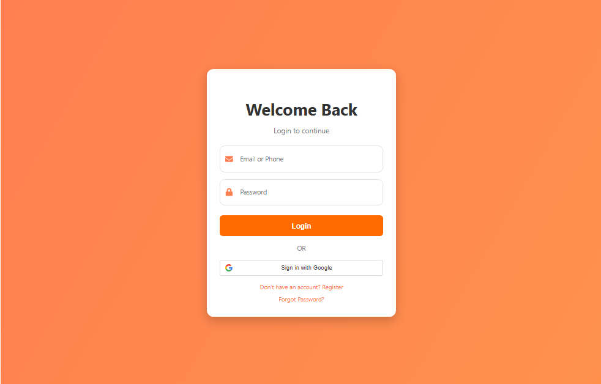
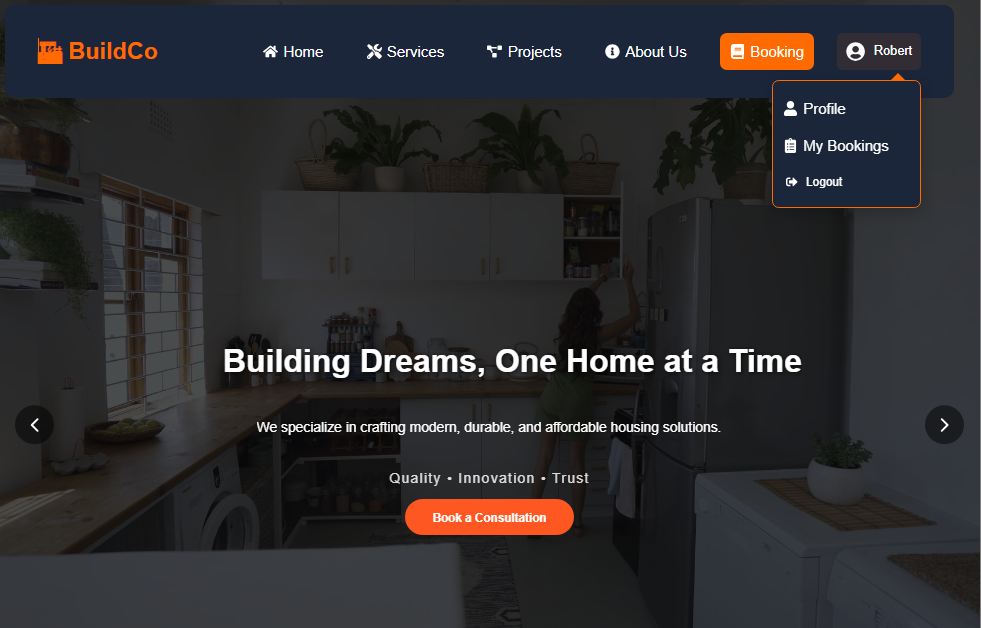
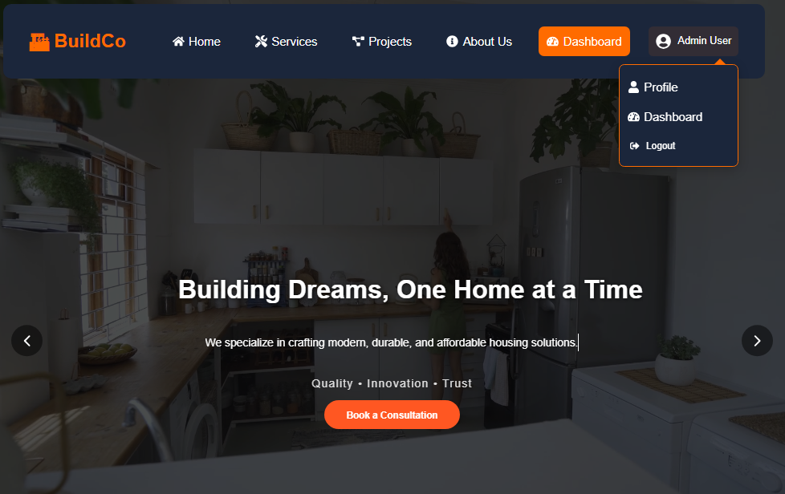
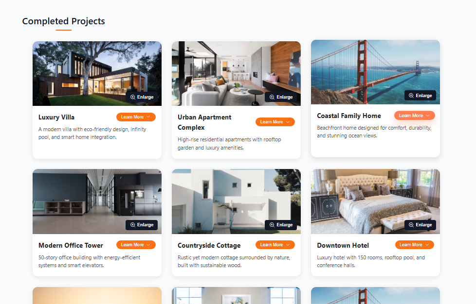

# 🏗️ Building & Project Management System 

A **full-stack MERN web application** for managing building projects and bookings.  
This system is designed with a **modern, responsive UI**, secure **authentication & authorization**, and a smooth user experience powered by **React, Node.js, Express, and MongoDB**.

The project demonstrates **real-world web development practices** such as protected routes, JWT-based authentication, secure APIs, reusable components, and user/admin role management.

---

## 📌 Table of Contents
- [Demo](#demo)
- [Features](#features)
- [Tech Stack](#tech-stack)
- [Installation](#installation)
- [Usage](#usage)
- [Project Structure](#project-structure)
- [Contributing](#contributing)

---

## 🎥 Demo

> Here are some screenshots of the system in action:  

- **Landing Page (Protected Booking)**  
  > The landing page is public, but users **cannot book unless they log in** because routes are **protected by JWT authentication**.  
    

- **Authentication (Login & Register)**  
  > Users can register with **email/password** or use **Google Authentication** for a faster signup. The system uses **JWT + tokens** for secure sessions, handled by Axios interceptors.  
    
    

- **User Dashboard (After Login)**  
  > Once authenticated, users can:  
  - Book a project.  
  - View all their bookings.  
  - Update their profile securely.  
  - Logout at any time.  
    

- **Admin Dashboard**  
  > Admins have elevated privileges:  
  - View **all bookings** from every user.  
  - Manage users and projects.  
  - Update their profile.  
  - JWT-protected API ensures only admins can access this section.  
    

- **Modal View & Project Details**  
  > Clicking a project image opens a **modal with an enlarged view** and detailed info.  
    

---

## ✨ Features

- 🔐 **Authentication & Authorization**
  - Register/Login with email & password.
  - Google Authentication integrated.
  - Secure sessions using **JWT tokens**.
  - **Protected routes** – users cannot access booking pages without login.
  - Axios interceptors manage requests with tokens.

- 👥 **User Roles**
  - **User** can:
    - Book a project.
    - View their bookings.
    - Update profile details.
    - Logout securely.
  - **Admin** can:
    - View all user bookings.
    - Manage projects and profiles.
    - Access secure admin routes.

- 📋 **Projects Management**
  - Projects divided into **Completed** and **Ongoing**.
  - Each project has:
    - Image with **enlarge modal**.
    - Title, description, location, completion date.
    - Progress bar (for ongoing projects).
    - Cost and other details.

- 🖼️ **Modern UI**
  - Responsive design with **cards, hover effects, and modals**.
  - Progress bars to track ongoing projects.
  - Clean **dashboard layout** for both user and admin.

- ⚡ **Performance & Security**
  - Secure API endpoints with JWT.
  - Axios for smooth API integration.
  - Role-based access control (Admin vs User).
  - Logout clears session and tokens.

---

## 🛠️ Tech Stack

**Frontend:** React.js, Axios, CSS, React Router DOM  
**Backend:** Node.js, Express.js  
**Database:** MongoDB with Mongoose  
**Authentication:** JWT, Google OAuth, Bcrypt (for password hashing)  
**Other:** Git, GitHub, REST APIs  

---

## ⚙️ Installation

1. Clone the repository:
   ```bash
   git clone https://github.com/codeby-david/building-management-system.git
Navigate to the project:

2. Backend Setup:
   ```bash
    cd backend
    npm install

Create a .env file in backend/ with:
    MONGO_URI=your_mongo_connection_string
    JWT_SECRET=your_secret_key
    GOOGLE_CLIENT_ID=your_google_client_id
    GOOGLE_CLIENT_SECRET=your_google_client_secret

Start backend server:
    ```bash
    node server.js

Runs on http://localhost:5000/ (or your configured port).

3️⃣ Frontend Setup
    cd frontend
    npm install
    npm run dev
Runs on http://localhost:3000/.

Creating an Admin User

To create an admin manually in the database:
Option 1: Use Mongo Shell / Compass

Insert a user document with role "admin" and hashed password.
Example using Node.js REPL (inside backend):

  // Run this inside backend folder
const bcrypt = require("bcryptjs");
const mongoose = require("mongoose");
const User = require("./models/User"); // adjust path if needed

// backend/seedAdmin.js
const mongoose = require("mongoose");
const bcrypt = require("bcryptjs");
const User = require("./models/User"); // adjust if your User model path differs
require("dotenv").config();

const createAdmin = async () => {
  try {
    // Connect to MongoDB
    await mongoose.connect(process.env.MONGO_URI, {
      useNewUrlParser: true,
      useUnifiedTopology: true,
    });

    // Check if admin already exists
    const existingAdmin = await User.findOne({ email: "admin@example.com" });
    if (existingAdmin) {
      console.log("⚠️ Admin already exists!");
      mongoose.disconnect();
      return;
    }

    // Hash password
    const hashedPassword = await bcrypt.hash("AdminPassword123", 10);

    // Create new admin
    const admin = new User({
      name: "Admin",
      email: "admin@example.com",
      password: hashedPassword,
      role: "admin",
    });

    await admin.save();
    console.log("   Admin user created successfully!");
    console.log("   Login with:");
    console.log("   Email: admin@example.com");
    console.log("   Password: AdminPassword123");

    mongoose.disconnect();
  } catch (error) {
    console.error("Error creating admin:", error);
    mongoose.disconnect();
  }
};

createAdmin();


After running, you can login with:
  Email: admin@example.com
Password: AdminPassword123

📂 Project Structure
  building-management-system/
│── backend/          # Express + MongoDB backend
│   ├── models/       # Database schemas
│   ├── routes/       # API routes
│   ├── controllers/  # Business logic
│   ├── middleware/   # JWT auth, error handlers
│   └── server.js     # Backend entry point
│
│── frontend/         # React frontend
│   ├── components/   # Navbar, Footer, Cards, Modal
│   ├── pages/        # Landing, Projects, Dashboard, Auth
│   ├── context/      # Auth context with JWT
│   ├── api/axios.js  # Axios setup with interceptors
│   └── styles/       # CSS files
│
│── .env              # Environment variables
│── package.json
│── README.md
